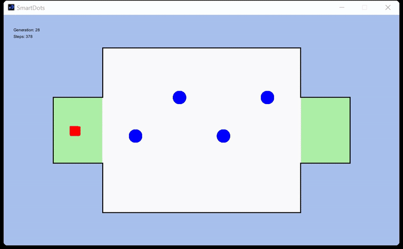
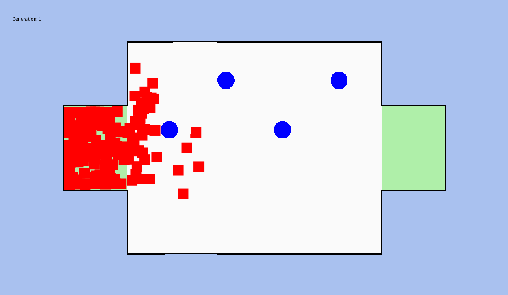
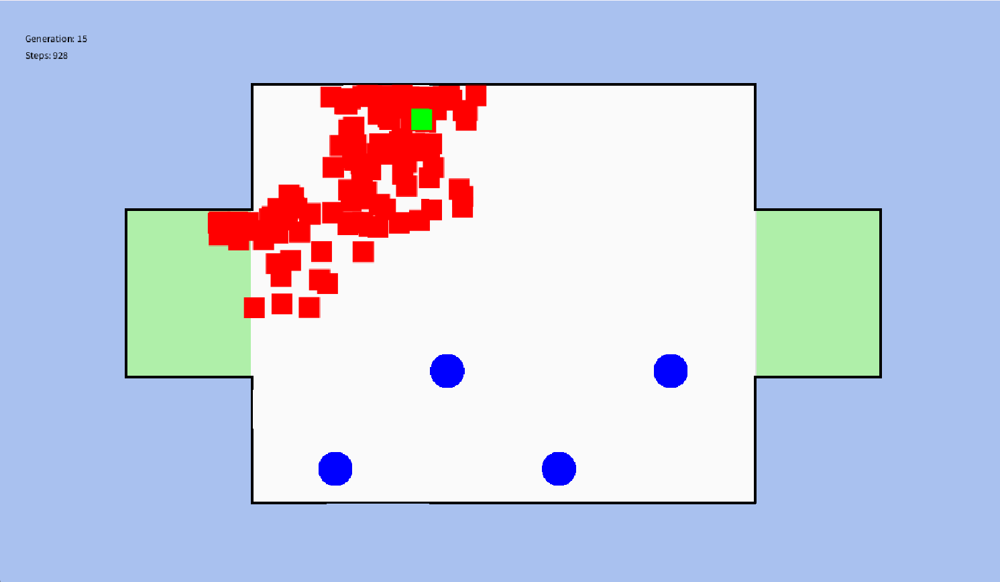
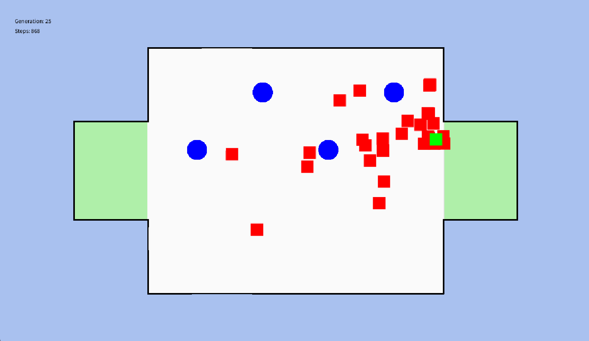

# 🧠 AI Pathfinding Agent for *The World’s Hardest Game* using Genetic Algorithms

This project trains an AI agent to solve *The World’s Hardest Game* by evolving movement strategies over generations using a custom genetic algorithm.

It demonstrates core software engineering principles: optimization, simulation control, agent design, and algorithm development — without using reinforcement learning or neural networks.

---

## 🎥 Demo



> Watch how the AI gets better and smarter over generations.

---

## 🚀 Features

- Evolving population of agents attempting to reach a goal
- Fitness-based selection and ranking
- Mutation of direction vectors to introduce variation
- Dynamic obstacles: Includes moving enemies that act as hazards the agents must avoid
- Adjustable parameters (mutation rate, population size, max steps)

---

## 🧠 How It Works

Each agent (square) contains a fixed-length "brain" — a list of directional vectors representing a path. The process is as follows:

1. **Spawn** a population of agents with random directions
2. **Simulate** their movement through the game environment
3. **Calculate fitness** based on distance to the goal or goal completion
4. **Select the best-performing agents**
5. **Mutate** their direction vectors to create the next generation
6. **Repeat** to evolve optimal solutions over time


---

## 🛠️ Built With

- [Processing (Java-based)](https://processing.org/)
- Object-Oriented Design
- Custom Genetic Algorithm (no external AI libraries)

---

## 🧪 Getting Started

### 1. Clone the Repo
```bash
git clone https://github.com/inikola3/genetic-algorithm-pathfinding.git
```


### 2. Open in Processing

```markdown
### Open the Project in Processing

- Download and install the [Processing IDE](https://processing.org/download)
- Open the `SmartDots.pde` file (or the sketch folder containing all `.pde` files)
- Ensure files like `Dot.pde`, `Population.pde`, and others are in the same directory

```
### 3. Run the Simulation
```markdown

- Click the **Run** button in the Processing IDE
- The simulation will launch and begin evolving agents (squares)
- You'll see how agents attempt to reach the goal and improve over generations

```


---

### 📌 SECTION 7: Screenshots


## 🖼️ Screenshots

| Generation 1 | Generation 15 | Generation 25 |
|--------------|----------------|----------------|
|  |  |  |


## 🙏 Acknowledgments

- Concept adapted from *The World’s Hardest Game*, a Flash game originally developed by Snubby Land
